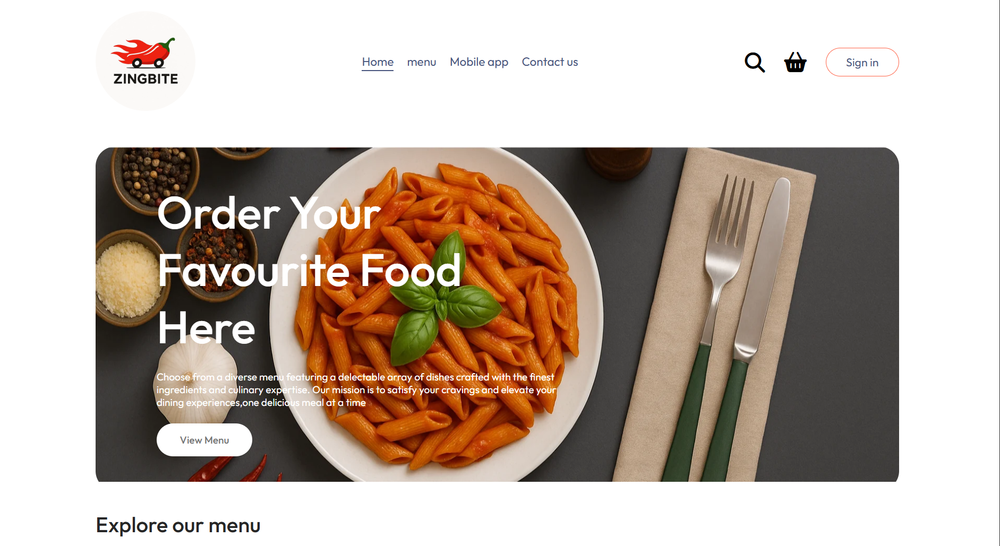
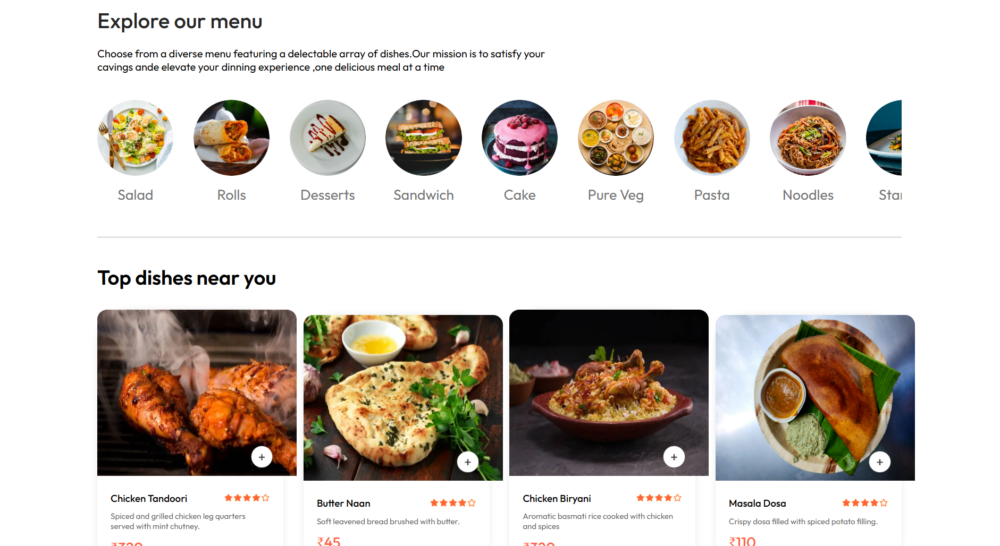
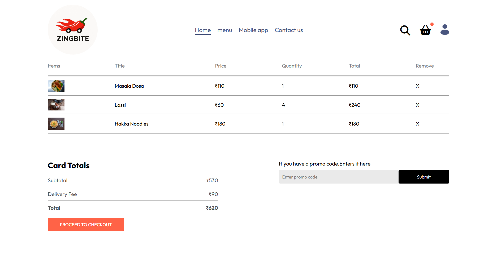
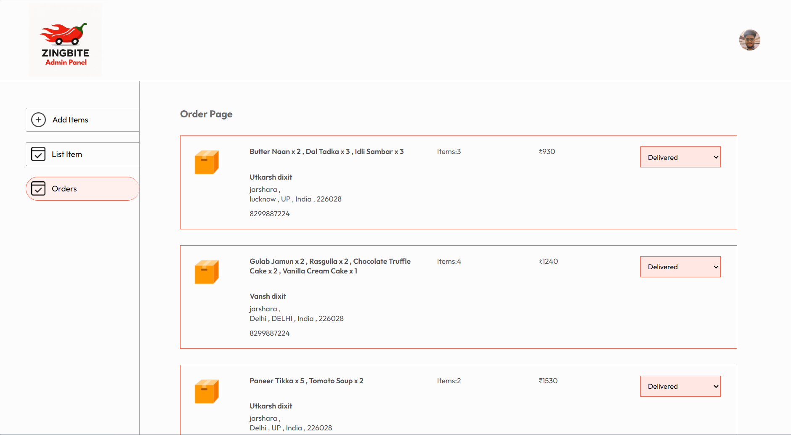
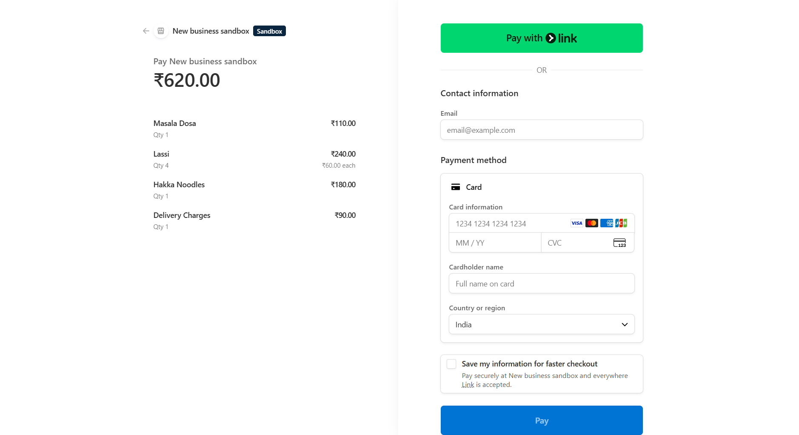

# 🍔 ZingBite — Full-Stack Food Delivery Platform

> A production-ready food delivery web application built on the MERN stack with Stripe payments, JWT authentication, and a dedicated restaurant admin panel.


[](https://food-del-frontend-anq3.onrender.com/)
[](https://food-del-admin-2tq7.onrender.com/)

---

**ZingBite** is a three-app food delivery platform — customer storefront, restaurant admin panel, and REST API — all built from scratch.

- 🔐 **JWT Auth** — Secure register/login with bcrypt-hashed passwords and token-based sessions
- 🛒 **Persistent Cart** — Cart syncs to MongoDB so items survive logout and page refresh  
- 💳 **Stripe Payments** — Full hosted checkout with server-side payment verification
- 🛠️ **Admin Panel** — Separate app to manage menu items and update order statuses in real time

---

## 🌐 Live Demo

| App | URL |
|---|---|
| 🛍️ Customer Storefront | [food-del-frontend-anq3.onrender.com](https://food-del-frontend-anq3.onrender.com/) |
| 🛠️ Admin Panel | [food-del-admin-2tq7.onrender.com](https://food-del-admin-2tq7.onrender.com/) |


## 📸 Screenshots

### 🏠 Homepage



---

### 🛒 Cart Page


---

### 🛠️ Admin Panel


---

### 💳 Stripe Checkout


---

## 🏗️ Architecture

```
┌─────────────────────┐      ┌─────────────────────┐
│   React Frontend    │      │    React Admin Panel │
│  (Customer Store)   │      │  (Restaurant Mgmt.)  │
└────────┬────────────┘      └──────────┬───────────┘
         │                              │
         │         REST API             │
         └──────────────┬───────────────┘
                        │
              ┌─────────▼──────────┐
              │  Express.js Server │
              │   + JWT Auth MW    │
              └────┬──────────┬────┘
                   │          │
        ┌──────────▼──┐  ┌────▼───────┐
        │   MongoDB   │  │   Stripe   │
        │  (Mongoose) │  │  Payments  │
        └─────────────┘  └────────────┘
```

---

## 🛠 Tech Stack

### Frontend & Admin
| Technology | Purpose |
|---|---|
| **React 19** | UI framework |
| **React Router DOM v7** | Client-side routing |
| **Axios** | HTTP client for API calls |
| **Vite** | Build tool & dev server |
| **React Toastify** | Toast notifications (Admin) |
| **Context API** | Global state management |

### Backend
| Technology | Purpose |
|---|---|
| **Node.js + Express 5** | REST API server |
| **MongoDB + Mongoose** | Database & ODM |
| **JWT (jsonwebtoken)** | User authentication tokens |
| **bcrypt** | Secure password hashing |
| **Multer** | Multipart image file uploads |
| **Stripe** | Hosted payment processing |
| **dotenv** | Environment variable management |
| **validator** | Input sanitization & validation |

---

## 📁 Project Structure

```
ZingBite/
├── Frontend/                   # Customer storefront
│   └── src/
│       ├── components/
│       │   ├── Navbar/         # Navigation bar with cart icon & login trigger
│       │   ├── Header/         # Hero section
│       │   ├── ExploreMenu/    # Category filter bar
│       │   ├── FoodDisplay/    # Grid of food items
│       │   ├── FoodItem/       # Individual food card with add/remove controls
│       │   ├── LoginPopup/     # Auth modal (Login / Register)
│       │   ├── AppDownload/    # App download banner
│       │   └── Footer/         # Site footer
│       ├── pages/
│       │   ├── Home/           # Landing page
│       │   ├── Cart/           # Shopping cart page
│       │   ├── PlaceOrder/     # Checkout & delivery address form
│       │   ├── Verify/         # Stripe payment verification callback
│       │   └── MyOrders/       # User order history
│       └── Context/
│           └── StoreContext.jsx  # Global state (cart, auth token, food list)
│
├── admin/                      # Restaurant admin panel
│   └── src/
│       ├── Components/
│       │   ├── Navbar/         # Admin top navigation
│       │   └── Sidebar/        # Admin sidebar links
│       └── pages/
│           ├── Add/            # Add new food item with image upload
│           ├── List/           # View & delete all menu items
│           └── Orders/         # View & update order statuses
│
└── backend/                    # REST API server
    ├── config/                 # MongoDB connection setup
    ├── controllers/
    │   ├── userController.js   # Register / Login + JWT generation
    │   ├── foodControllers.js  # Add / List / Remove food items
    │   ├── cartControllers.js  # Cart CRUD (add, remove, get)
    │   └── orderControllers.js # Order placement, Stripe session, verification
    ├── middleware/
    │   └── auth.js             # JWT verification middleware (protects user routes)
    ├── models/
    │   ├── userModel.js        # User schema (name, email, password, cartData)
    │   ├── foodModels.js       # Food item schema
    │   └── orderModels.js      # Order schema with payment & status
    ├── routes/
    │   ├── userRouter.js       # /api/user
    │   ├── foodRoute.js        # /api/food
    │   ├── cartRoute.js        # /api/cart
    │   └── orderRoute.js       # /api/order
    ├── uploads/                # Uploaded food images (served statically)
    └── server.js               # Express entry point
```

---

## ✨ Core Features

### 👤 User Authentication
- **Register** — Users sign up with name, email, and password. Email is validated via `validator`, passwords are hashed with **bcrypt** (10 salt rounds) before storage.
- **Login** — Returns a signed **JWT token** stored in `localStorage` for persistent sessions across page refreshes.
- **Protected Routes** — The `authMiddleware` verifies the JWT on every protected request, extracts the `userId`, and injects it into `req.body`.

### 🍽️ Menu Browsing
- The homepage fetches the full food list from the backend on load.
- Customers can **filter items by category** using the `ExploreMenu` component.
- Each `FoodItem` card displays the image, name, description, star rating, and price.

### 🛒 Shopping Cart
- Add or remove items directly from the food grid using `+` / `-` controls.
- Cart state is managed globally via **React Context API** (`StoreContext`).
- When logged in, cart changes are **synced to the database** via `/api/cart` — so the cart is restored on next login.
- The cart page shows a **live subtotal**, a fixed **₹90 delivery fee**, and the final total.

### 💳 Checkout & Stripe Payments
- Users fill in a delivery address on the **Place Order** page.
- The backend saves the order to MongoDB, clears the cart, and creates a **Stripe Checkout Session** with itemized line items plus delivery charges.
- Users are redirected to Stripe's secure hosted payment page.
- On completion, Stripe redirects back to `/verify` — successful payments mark the order as paid; cancelled orders are deleted automatically.

### 📦 Order Tracking
- **My Orders** shows the full history of a user's orders with item count, total, and live status (e.g., *Food Processing → Out for Delivery → Delivered*).

### 🛠️ Admin Panel
A fully separate React application for restaurant management:

- **Add Food Item** — Upload a food image (handled by Multer), set name, description, price, and category. Immediately available on the storefront.
- **Food List** — View all menu items with images and prices. Deleting an item also removes the image file from the server.
- **Orders Management** — View all customer orders. Update any order's status via a dropdown selector.

---

## 🔌 API Endpoints

> 🔐 = Protected by `authMiddleware` (requires valid JWT in request header)
> ⚠️ = Admin-only route — **recommend adding admin middleware in production**

### User — `/api/user`
| Method | Endpoint | Description | Auth |
|---|---|---|---|
| `POST` | `/register` | Register a new user | Public |
| `POST` | `/login` | Login and receive a JWT | Public |

### Food — `/api/food`
| Method | Endpoint | Description | Auth |
|---|---|---|---|
| `POST` | `/add` | Add a new food item (with image) | ⚠️ Admin |
| `GET` | `/list` | Get all food items | Public |
| `POST` | `/remove` | Remove a food item by ID | ⚠️ Admin |

### Cart — `/api/cart`
| Method | Endpoint | Description | Auth |
|---|---|---|---|
| `POST` | `/add` | Add an item to the user's cart | 🔐 JWT |
| `POST` | `/remove` | Remove an item from the user's cart | 🔐 JWT |
| `POST` | `/get` | Fetch the user's current cart | 🔐 JWT |

### Orders — `/api/order`
| Method | Endpoint | Description | Auth |
|---|---|---|---|
| `POST` | `/place` | Place order & get Stripe checkout URL | 🔐 JWT |
| `POST` | `/verify` | Confirm or cancel Stripe payment | Public |
| `POST` | `/userorders` | Get logged-in user's order history | 🔐 JWT |
| `GET` | `/list` | Get all orders (admin view) | ⚠️ Admin |
| `POST` | `/status` | Update an order's status | ⚠️ Admin |

> **⚠️ Security Note:** Food management and admin order routes currently lack an admin authentication guard. Adding a role-based admin middleware is recommended before any production deployment.

### Static Files
- `GET /images/:filename` — Serves uploaded food item images from the `/uploads` directory

---

## 📐 Data Models

### User
```js
{
  name: String,       // required
  email: String,      // unique
  password: String,   // bcrypt-hashed, never stored in plain text
  cartData: Object    // persisted cart state { itemId: quantity }
}
```

### Food Item
```js
{
  name: String,
  description: String,
  price: Number,
  image: String,      // stored filename, served via /images/:filename
  category: String
}
```

### Order
```js
{
  userId: String,     // reference to User._id
  items: Array,       // snapshot of ordered food items
  amount: Number,     // total order value
  address: Object,    // delivery address object
  status: String,     // default: "Food Processing"
  date: String,       // order timestamp
  payment: Boolean    // true after Stripe payment confirmed
}
```

---

## ⚙️ Engineering Challenges

Real problems solved during development — not just boilerplate:

- **Persistent Cart Sync** — Cart state lives in both React Context (for instant UI updates) and MongoDB (for cross-session persistence). Keeping these in sync on add/remove operations without race conditions required careful async sequencing.

- **Stripe Payment Verification Flow** — After a Stripe redirect, the app must verify payment server-side before marking an order as paid. Implemented a `/verify` callback route that handles both success and cancellation — deleting the order on cancel to avoid ghost records in the DB.

- **JWT Auth Middleware** — The `authMiddleware` extracts the token from request headers, verifies it against the secret, and injects `userId` into `req.body` so downstream controllers don't handle auth logic at all — clean separation of concerns.

- **Image Upload Handling with Multer** — Food images are stored on the server filesystem via Multer, served as static files, and cleaned up from disk when a food item is deleted — preventing orphaned files from accumulating.

- **Cart State on Login** — When a user logs in after adding items as a guest, the app calls `/api/cart/get` and merges the server-side cart back into React state, ensuring no items are lost across sessions.

---

## 🔮 Future Improvements

Planned features and architectural upgrades:

- [ ] **Role-Based Admin Authentication** — Dedicated admin accounts with protected middleware instead of open admin routes
- [ ] **Real-Time Order Tracking** — WebSocket integration (Socket.IO) for live status updates pushed to the customer
- [ ] **Redis Caching** — Cache the food list to reduce DB reads on high-traffic endpoints
- [ ] **Docker Deployment** — Containerize all three services with `docker-compose` for reproducible deployments
- [ ] **Search & Filters** — Full-text food search and advanced filtering (price range, rating, dietary preference)
- [ ] **Email Notifications** — Order confirmation and status update emails via Nodemailer or SendGrid
- [ ] **Mobile App** — React Native port of the customer storefront

---

## 🚀 Getting Started

### Prerequisites
- Node.js v18+
- MongoDB instance (local or Atlas)
- Stripe account (for API keys)

### 1. Clone the Repository
```bash
git clone https://github.com/Utkarshdixit11/ZingBite.git
cd ZingBite
```

### 2. Setup & Run the Backend
```bash
cd backend
npm install
# Create a .env file — see Environment Variables section below
npm run server
# ✅ Server starts at http://localhost:4000
```

### 3. Setup & Run the Frontend
```bash
cd Frontend
npm install
npm run dev
# ✅ Customer app at http://localhost:5173
```

### 4. Setup & Run the Admin Panel
```bash
cd admin
npm install
npm run dev
# ✅ Admin panel at http://localhost:5174
```

---

## 🔐 Environment Variables

Create a `.env` file inside the `backend/` directory:

```env
# MongoDB Connection
MONGO_URI=mongodb+srv://<username>:<password>@cluster.mongodb.net/zingbite

# JWT Secret (use a long, random string)
JWT_SECRET=your_super_secret_jwt_key

# Stripe Secret Key
STRIPE_SECRET_KEY=sk_test_...

# Server Port (optional, defaults to 4000)
PORT=4000
```

---

## 📸 App Pages Overview

| Page | Route | Description |
|---|---|---|
| Home | `/` | Hero section, category filter, food grid |
| Cart | `/cart` | Cart items, subtotal, delivery fee, checkout |
| Place Order | `/order` | Delivery address form → Stripe redirect |
| Payment Verify | `/verify` | Stripe success/cancel handler |
| My Orders | `/myorders` | Full order history with live status |
| Admin – Add | `/add` | Upload & create new food item |
| Admin – List | `/list` | View & remove menu items |
| Admin – Orders | `/order` | View all orders, update status |

---

## 👨‍💻 Author

**Utkarsh Dixit**
Full Stack Developer focused on scalable MERN applications and real-world product engineering.

[](https://github.com/Utkarshdixit11)
[](https://www.linkedin.com/in/utkarshdixit9/)

---

> ⭐ If you found this project helpful, consider giving it a star!
